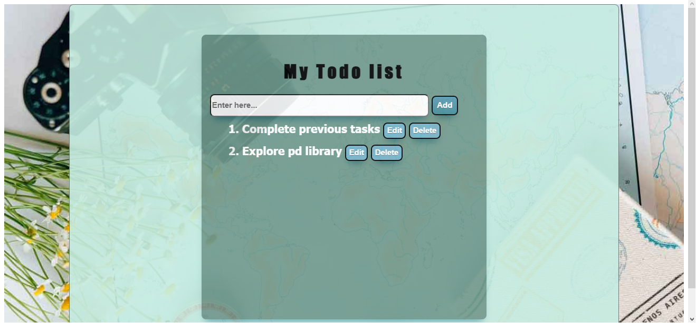

# Todo App
This is a simple todo app.
## Features  ✨

- Add tasks
- Edit tasks
- Delete tasks

## Tech

- [vuejs] - The Progressive JavaScript Framework
- [HTML] - HTML is the standard markup language for Web pages.
- [css] - Cascading Style Sheets (CSS) is a simple mechanism for adding style (e.g., fonts, colors, spacing) to Web documents.

[vuejs]: <https://vuejs.org>
[html]: <https://en.wikipedia.org/wiki/HTML>
[css]: <https://www.w3.org/Style/CSS/Overview.en.html>

